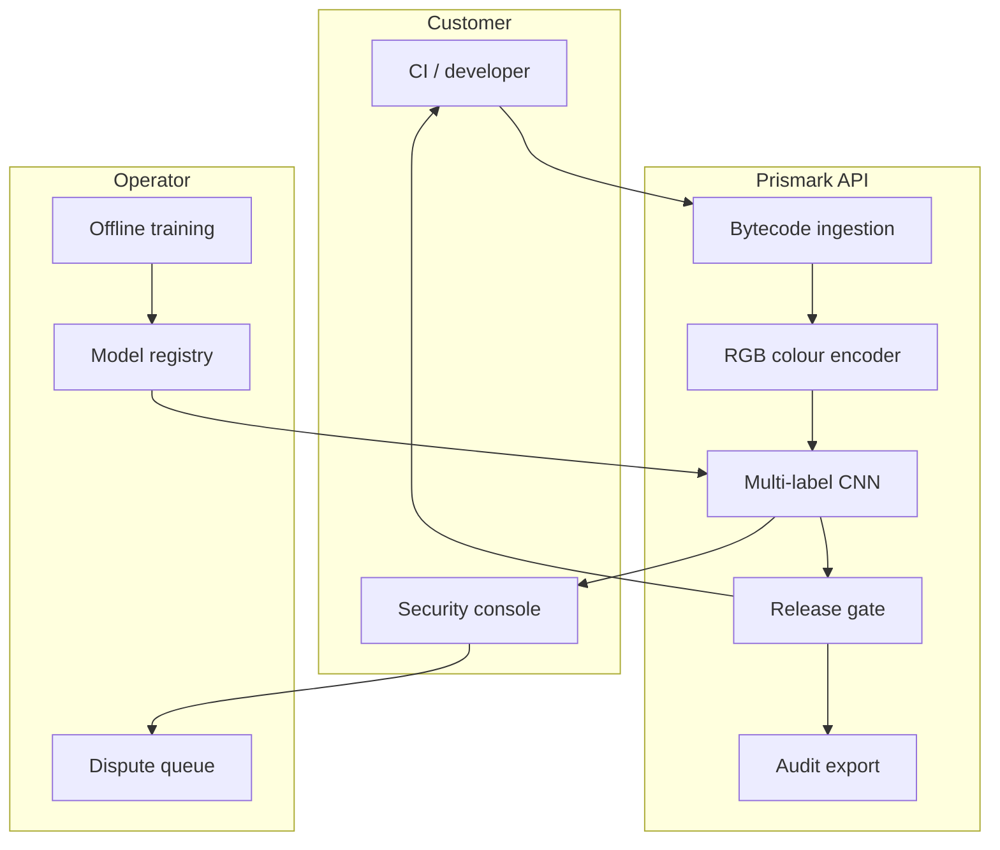

# Prismark

**Source:** `ai-in-decentralized+ai/research-paper_1807.01868v1/`
**Domain:** `ai-decentralized`
**One-liner:** A pre-deployment smart-contract scanner that turns EVM bytecode into color images and returns multi-label compiler-bug classifications in seconds, so protocol teams catch immutable defects before mainnet capital is locked.
**Wedge:** Ethereum protocol and DeFi engineering teams shipping Solidity contracts to mainnet at least weekly, where each release touches TVL or user funds and security review is the bottleneck before launch.
**Positioning:** A machine-learning bytecode triage layer for smart-contract security. Symbolic tools (Oyente, ZEUS, F*) demand expert CFG/feature work and miss the labour problem; Prismark removes hand-crafted features by encoding bytecode as RGB images and classifying known Solidity compiler bug families before the irreversible deploy.

## Market research synthesis

### Thesis from source

The paper argues that Ethereum’s commercial success — smart contracts, Dapps, and DAOs — has outrun security practice. Contracts are transparent and immutable: a vulnerability is visible to attackers immediately and cannot be patched after deployment. The DAO loss above $50M is the canonical proof. Related work cited in the paper found roughly 34,200 vulnerable contracts among nearly one million analysed, with nearly 4,000 practically exploitable; Oyente flagged 8,833 of 19,366 contracts; ZEUS reported 94.6% of ~22.4K contracts vulnerable, holding more than $0.5B in cryptocurrency. Known defect classes include call-stack attacks, time dependence, and a catalogue of Solidity compiler bugs such as `optimizerStateKnowledgeNotResetForJumpdest`, `ArrayAccessCleanHigherOrderBits`, and `AncientCompiler`.

Status-quo analysers rely on static/symbolic methods that need expert labour to extract CFG features and execution paths. The authors reject that labour model. They translate Solidity bytecode into RGB colour codes (24-bit pixels, ~16.7M colours versus 256 greyscale levels), render fixed-size images, and train CNNs (AlexNet, GoogleNet, Inception-v3) for automatic feature learning. Because compiler bugs rarely appear alone, they move from single-label to multi-label classification via transfer learning on Inception-v3, reporting ~1.5 seconds per analysis. On held-out Etherscan-verified contracts, Inception-v3 reaches roughly 95–98% accuracy/precision/recall depending on learning rate and epoch count. Market context in the conclusion: ~1,800 new mainnet contracts per day, fewer than 30% Etherscan-verified, and ~$11.75B financed by ICO projects in 2018 — making pre-deploy loophole detection a commercial gate, not a research curiosity.

The product insight is therefore not “another Oyente.” It is a low-labour, bytecode-only triage API that produces multi-label bug findings fast enough to sit in CI before every mainnet deploy, with human auditors reserved for confirmed or high-severity hits.

### Buyer & economic model

- **Primary buyer:** Head of Security or Protocol Engineering lead at a DeFi / L2 / NFT protocol; secondary buyer: security audit firms offering automated pre-screen as a productised intake step.
- **Users:** smart-contract developers (daily CI), security engineers (triage and override), release managers (go/no-go gates), external auditors (intake enrichment).
- **Budget owner / value metric:** security / protocol engineering budget. Value metric is defects caught pre-deploy per release, mean time from bytecode submit to multi-label report, and avoided post-deploy incident cost (measured against historical exploit severity, not vanity scan counts).
- **Competing status quo:** manual audit queues, Oyente/Mythril/Slither-style static pipelines that require source and expert tuning, and “verify on Etherscan after deploy” which is too late for immutable code.

### Domain constraints

- **Regulatory / trust / safety:** false negatives on fund-bearing contracts create existential risk; false positives create alert fatigue and ignored gates. Findings must be labelled with confidence and bug taxonomy, not a binary “safe.”
- **Data sensitivity:** bytecode and (optional) source are commercially sensitive pre-launch IP; scans must be tenant-isolated and retainable for audit without leaking to other customers.
- **Change-management realities:** teams will not replace auditors; Prismark is a gate *before* human review. Multi-label imbalance (few vulnerable vs many benign; rare bug classes) requires continuous model refresh and human override of disputed labels.

## Business requirements

- BR-1: Any submitted bytecode must return a multi-label classification over known Solidity compiler-bug families within a time box compatible with CI (order of seconds, not hours).
- BR-2: A release cannot be marked “cleared for mainnet” while any high-severity label remains open without an explicit human override with recorded rationale.
- BR-3: Classification must work from bytecode alone so unverified or closed-source builds are still scannable; source is optional enrichment, not a dependency.
- BR-4: Every finding must cite the bug family identifier and confidence so security engineers can map to known compiler advisories without re-deriving features.
- BR-5: The platform must support batch scanning of contract families (proxy, implementation, libraries) as a single release unit with a roll-up go/no-go status.
- BR-6: Model versions used for a scan must be immutable and recorded so historical clearance decisions remain reproducible after model upgrades.
- BR-7: False-positive disputes must enter a review queue with outcome fed back into labelled training sets under governance, not silent suppression.
- BR-8: Customers must export an audit package tying commit/build hash, bytecode hash, labels, overrides, and model version for external auditors and insurers.
- BR-9: Tenant data isolation is mandatory: one customer’s pre-launch bytecode must never appear in another tenant’s training or UI.
- BR-10: The commercial offer must price on scan volume and retained projects, not on “AI seats,” and disclose whether findings are advisory versus gate-blocking.
- BR-11: When the model returns “unknown / low confidence,” the system must fail closed for gate mode rather than auto-clear.
- BR-12: Performance KPIs (precision/recall by bug family on a held-out labelled set) must be published to the customer on each model promotion.

## User stories

Canonical user stories live in sibling [USER_STORIES.md](USER_STORIES.md).

## System design

### Overview

Prismark accepts bytecode (hex) or an address-linked pull from explorers, encodes it into a fixed-size RGB image using the solidity-to-colour mapping described in the source, runs a multi-label CNN classifier, and returns bug-family labels with confidences. Online path: upload → encode → infer → visualise/API response. Offline path: crawl/labelled corpora → train/validate → promote model. Human overrides and disputes feed a governed relabel queue. Gate mode consumes the roll-up status in CI.

### Actors & boundaries

- **Actors:** developers, security engineers, release managers, auditors, platform operators, model governors.
- **Trust boundary:** customer bytecode stays in the tenant boundary; only aggregate, consented labelled samples enter training. Model artefacts are operator-controlled but version-pinned per scan.
- **Human-in-the-loop points:** high-severity override, dispute adjudication, model promotion approval, fail-closed review of low-confidence results.

### Core capabilities

1. **Bytecode ingestion** — hex upload, explorer fetch, build-artefact hash binding.
2. **Colour encoding** — deterministic bytecode→RGB image transform.
3. **Multi-label classification** — CNN inference over compiler-bug families.
4. **Release gating** — project policies, severity thresholds, fail-closed rules.
5. **Override and dispute** — rationaled exceptions and feedback to labelling.
6. **Model registry** — versioning, promotion, per-project pins, KPI publication.
7. **Audit export** — clearance certificates and evidence packages.

### Conceptual data

- **Primary entities:** Project, ContractArtefact, BytecodeImage, ScanJob, BugLabel, ModelVersion, Override, Dispute, ClearanceCertificate.
- **Critical events:** artefact submitted, image encoded, labels emitted, gate evaluated, override recorded, model promoted, certificate issued.
- **Retention / audit needs:** scan evidence and certificates retained for the commercial and insurance window; raw bytecode retention configurable per tenant with deletion on request except legally required audit copies.

### Integrations (conceptual)

- **Systems of record:** Git CI, artefact registries, Etherscan-class explorers, ticketing (Jira), audit workspaces.
- **Upstream signals:** labelled bug corpora, compiler advisory feeds, prior overrides.
- **Downstream actions:** CI fail/pass, Slack/Pager alerts, auditor package export, training-queue enqueue.

### High-level architecture

### Success metrics

- **Leading:** median scan latency; % releases scanned pre-deploy; override rate by bug family; low-confidence fail-closed rate.
- **Lagging:** precision/recall by family on customer-consented holdouts; post-deploy incidents on Prismark-cleared releases; auditor time saved on intake; paid scan retention.

## OpenAPI skeleton

Canonical HTTP surface lives in sibling [openapi.yaml](openapi.yaml). Summarize here:

- **Base path:** `/v1/...`
- **Auth:** API key for CI; Bearer JWT for console operators
- **Resource groups:** Projects, Artefacts, Scans, Models, Overrides, Certificates
