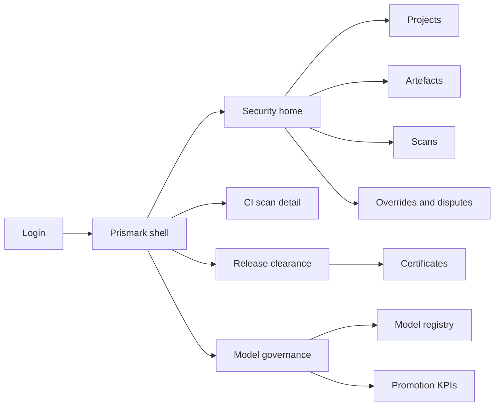
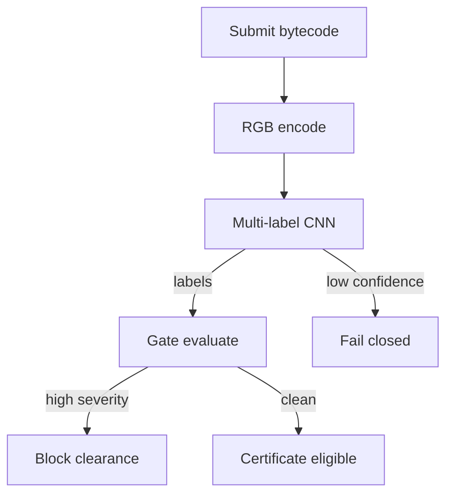
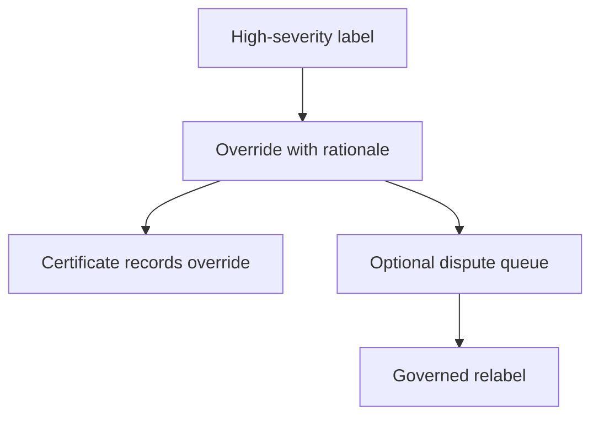

# Prismark — Web app

**Product:** [PRODUCT.md](./PRODUCT.md)
**Primary surface:** Pre-deploy bytecode triage console for DeFi / protocol security (CI-linked)
**Secondary surfaces:** Model governance console (operator); auditor clearance certificate viewer
**Design thesis:** Prismark is a colour darkroom for EVM bytecode — bytes become RGB frames, a multi-label CNN names compiler-bug families in seconds, and the release gate listens. The metaphor is a film strip of bytecode frames on a light table, not another CFG explorer and not a formal-prover IDE. Visual language is darkroom charcoal with emulsion-cyan highlights and label chips in calibrated severity inks: cleared frames feel stamped; high-severity labels feel sticky until overridden with rationale; low confidence fails closed. The wordmark sits as a quiet lab mark on every scan-bearing screen so release managers know whose colour-classifier cleared (or blocked) the immutable deploy.

## UX research synthesis

### Category peers (best-in-class)

- **MythX / Slither CI integrations:** Seconds-to-minutes scan in PR, severity roll-up. Steal: CI-native latency and roll-up go/no-go; reject source-required-only pipelines — Prismark must work bytecode-first.
- **Snyk / Semgrep PR annotation UX:** Family-labelled findings with confidence and fix hints. Steal: bug-family identifier + confidence on every label; reject generic “vulnerability score” without taxonomy.
- **Etherscan contract verification UX:** Bytecode/address binding and artefact identity. Steal: build/bytecode hash binding on every scan; reject “verify after deploy” as the safety story.
- **Hugging Face model cards (ops pattern):** Version pins, published metrics, promotion discipline. Steal: immutable model version per scan + published precision/recall by family on promotion; reject silent model swaps changing last week’s clearance.

### Patterns to adopt / reject

- **Adopt:** Bytecode→RGB preview; multi-label family chips in ~seconds; batch release-unit scan (proxy + impl + libs); fail-closed on low confidence; rationaled overrides; dispute → governed relabel queue; tenant isolation attestation; clearance certificates; advisory vs gate-blocking disclosure.
- **Reject:** Hand-crafted CFG feature worksheets as required UX; single-label only; auto-clear on unknown; purple “AI audited” badges; training on other tenants’ pre-launch bytecode; seat-based “AI seats” pricing chrome.

### Trust, density, and workflow constraints from PRODUCT.md

Scans return multi-label compiler-bug families in CI time boxes (BR-1). High-severity open labels block mainnet clearance without rationaled override (BR-2). Bytecode-alone sufficient (BR-3). Family id + confidence required (BR-4). Batch family roll-up (BR-5). Model version immutable per scan (BR-6). Disputes feed governed training, not silent mute (BR-7). Audit package export (BR-8). Tenant isolation (BR-9). Pricing/gate vs advisory disclosed (BR-10). Low confidence fail-closed in gate mode (BR-11). Family-level KPIs published on model promotion (BR-12).

## Information architecture

### Nav model

### Roles → default home

| Role | Default home | Why |
|------|--------------|-----|
| Security engineer | Security home — open high-severity labels | Triage before mainnet (BR-2) |
| Solidity developer | CI scan detail | Seconds-scale multi-label on PR (BR-1) |
| Release manager | Clearance certificates | Auditable go/no-go artefact |
| External auditor | Certificate + prior overrides | Intake enrichment (BR-8) |
| Model governor | Model registry | Promote only after family KPIs (BR-12) |
| Platform admin | Tenant isolation attestation | Enterprise questionnaires (BR-9) |

### Cross-links to OpenAPI resources

| Nav area | OpenAPI tags / resources |
|----------|---------------------------|
| Gate policies / projects | Projects |
| Bytecode / build bindings | Artefacts |
| Colour-encode + classify jobs | Scans |
| Pins and promotions | Models |
| Human exceptions / disputes | Overrides |
| Clearance artefacts | Certificates |

## Screen inventory

### Security home

- **Purpose:** Answer “what release units are blocked, disputed, or cleared — and by which model?”
- **Entry:** Security login.
- **Layout regions:** Brand lab mark; blocked releases; high-severity open labels; override queue depth; median scan latency; gate vs advisory mode badge.
- **Primary actions:** Open scan; batch-scan release; export certificate.
- **Empty / loading / error:** Empty = create project + first artefact; error with request id.
- **BR / story ties:** BR-1, BR-2, BR-10.

### Project and gate policy

- **Purpose:** Set severity thresholds, fail-closed rules, and advisory vs gate-blocking disclosure.
- **Entry:** Projects.
- **Layout regions:** Policy editor; model pin; tenant isolation attestation; pricing/mode disclosure line.
- **Primary actions:** Save policy; pin model; rotate API key for CI.
- **Empty / loading / error:** Unpinned model = cannot clear for mainnet.
- **BR / story ties:** BR-6, BR-9, BR-10, BR-11.

### Artefact binder

- **Purpose:** Bind bytecode hex / explorer pull to commit and bytecode hashes; optional source enrichment.
- **Entry:** Project → Artefacts.
- **Layout regions:** Artefact table; hash fields; source-optional badge; release-unit grouping (proxy, impl, libs).
- **Primary actions:** Upload hex; fetch address; group into release unit.
- **Empty / loading / error:** Invalid hex = inline; source never required.
- **BR / story ties:** BR-3, BR-5.

### Scan detail — colour frame + labels

- **Purpose:** Show deterministic RGB encoding preview and multi-label bug-family results with confidence.
- **Entry:** CI deep link; Scans nav.
- **Layout regions:** Bytecode image (fixed-size colour frame); label chips (family id, confidence, severity); model version stamp; latency; gate evaluation result.
- **Primary actions:** Override; dispute; re-scan with pinned model; open certificate path.
- **Empty / loading / error:** Encoding/infer in progress skeleton; low confidence = fail-closed banner in gate mode.
- **BR / story ties:** BR-1, BR-4, BR-6, BR-11.
- **Mobile notes:** Labels stack vertically; colour frame scales down but remains visible as trust cue.

### Batch release roll-up

- **Purpose:** One go/no-go across proxy, implementation, and libraries.
- **Entry:** Security home batch; release manager.
- **Layout regions:** Child artefact statuses; worst-label roll-up; override coverage.
- **Primary actions:** Clear unit when policy satisfied; open blocking child.
- **Empty / loading / error:** Partial scans = not clearable.
- **BR / story ties:** BR-5.

### Override and dispute desk

- **Purpose:** Rationaled human override; disputes enter governed relabel queue — never silent suppression.
- **Entry:** Scan label action; Overrides nav.
- **Layout regions:** Override form (rationale required); active overrides; dispute queue outcome; feedback-to-training indicator.
- **Primary actions:** Submit override; open dispute; resolve dispute (ops).
- **Empty / loading / error:** Empty rationale blocked; silent dismiss control must not exist.
- **BR / story ties:** BR-2, BR-7.

### Clearance certificate

- **Purpose:** Auditable artefact tying build/bytecode hashes, labels, overrides, and model version.
- **Entry:** Release clearance; auditor.
- **Layout regions:** Certificate body; hashes; model version; override list; signature/download.
- **Primary actions:** Issue; download pack; verify.
- **Empty / loading / error:** Open high-severity without override = cannot issue.
- **BR / story ties:** BR-8; release manager stories.

### Model registry and promotion

- **Purpose:** Version models, pin per project, publish family-level precision/recall before promotion.
- **Entry:** Ops Models.
- **Layout regions:** Version list; KPI table by bug family; promotion checklist; customer-visible KPI publish toggle.
- **Primary actions:** Promote; demote; pin to projects.
- **Empty / loading / error:** KPI below threshold = promotion blocked.
- **BR / story ties:** BR-6, BR-12.

### Tenant isolation attestation

- **Purpose:** Prove pre-launch bytecode never appears in other tenants’ training or UI.
- **Entry:** Admin settings; security questionnaire export.
- **Layout regions:** Attestation status; retention policy; deletion controls except legal audit copies.
- **Primary actions:** Download attestation; request deletion.
- **Empty / loading / error:** Failed attestation = enterprise block banner.
- **BR / story ties:** BR-9.

## Key flows

1. **CI bytecode triage** — submit hex → encode RGB → multi-label infer → gate evaluate; failure: low confidence fail-closed.

2. **False-positive override** — open label → written rationale → dual visibility in certificate → optional dispute to relabel queue (BR-7).

3. **Batch release unit** — group artefacts → roll-up → single go/no-go (BR-5).

4. **Model promotion** — held-out family KPIs → publish to customer → promote → pins remain until projects opt in (BR-12).

5. **Auditor intake** — export certificate + overrides + model version → human review starts enriched (BR-8).

## Design system

### Tokens (CSS variables)

- `--color-ink: #F0EEE8` — text on darkroom
- `--color-darkroom-950: #0A090C` — app ground
- `--color-darkroom-900: #16141A` — panels
- `--color-darkroom-700: #2E2A36` — rules
- `--color-emulsion: #3BB8C3` — colour-frame accent / brand cyan
- `--color-emulsion-dim: #1F6E75` — cyan on dark
- `--color-label-high: #E85D4C` — high-severity family
- `--color-label-mid: #E0A53A` — mid
- `--color-cleared: #4CAF7A` — clearance stamp
- `--color-mute: #9A95A3` — secondary
- `--font-display: "DM Sans", sans-serif` — lab titles (not Inter as hero alone; pair with mono)
- `--font-body: "IBM Plex Sans", sans-serif`
- `--font-mono: "IBM Plex Mono", monospace` — bytecode hashes, family ids, model versions
- `--space-1`…`--space-8`: 4px scale
- `--radius-sm: 2px`; `--radius-md: 6px` — film-frame sharp
- `--motion-develop: 220ms ease-out` — colour frame appear
- `--motion-label: 160ms ease-out` — label chip stamp
- `--motion-gate: 180ms ease-in-out` — fail-closed banner
- Atmosphere: darkroom grain, cyan safelight rim on scan screens — bytecode-as-image lab; no purple gradients; no cream-terracotta; no broadsheet.

### Typography & brand

- DM Sans for scan titles; mono for family ids and hashes.
- Prismark wordmark on every scan- and certificate-bearing view.
- Login: brand + “See compiler bugs before mainnet locks” + one CTA.

### Do / don’t

- **Do:** Show the colour frame; pin model versions; fail closed on unknown; require override rationale; batch roll-ups.
- **Don’t:** CFG homework as required path; silent label mute; auto-clear low confidence; purple “AI secure”; training leakage across tenants.

### Accessibility & domain trust cues

- Severity never colour-only — family text + confidence %.
- Live regions for gate blocks and scan completion.
- Focus: artefact → scan → override → certificate.
- Certificates machine-readable for insurers/auditors.

## Component patterns

- **BytecodeColourFrame** — fixed-size RGB preview of encoded artefact.
- **BugFamilyChip** — family id, confidence, severity.
- **ReleaseUnitRollup** — proxy/impl/lib aggregate go/no-go.
- **ModelPinStamp** — immutable model version on scan and certificate.
- **FailClosedBanner** — low-confidence gate block.
- **OverrideRationaleForm** — required written exception.
- **DisputeQueueRow** — governed relabel feedback.
- **ClearanceCertificate** — hashes + labels + overrides export.
- **FamilyKpiTable** — precision/recall on model promotion.

## Out of scope for v1 web

- Full formal verification IDE (see assurance desks elsewhere); holding deploy keys; replacing human auditors; on-chain exploit monitoring as primary; consumer wallet; training UI for arbitrary customer CNNs; cross-tenant data marketplace.
